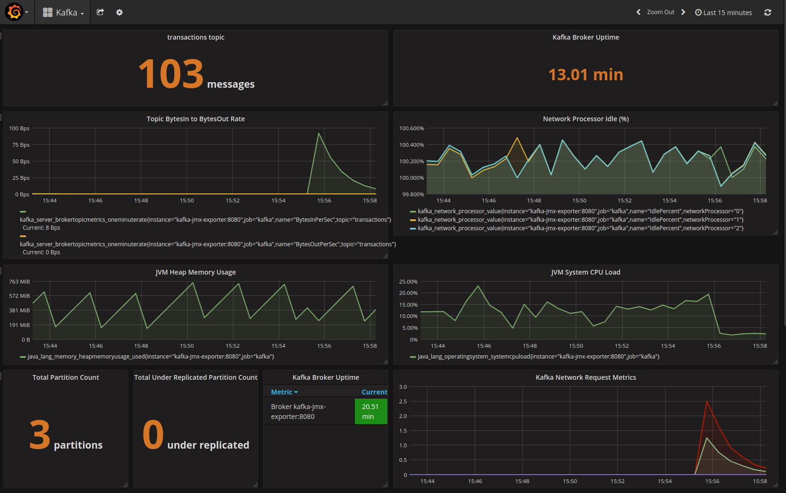

# Kafka Slack Bot

A simple Slack chatops bot, further writeup [here](https://medium.com/@russell.luc/simple-chatops-with-kafka-grafana-prometheus-and-slack-764ece59e707).

## Prerequisites
- Python 3.6+
- [Docker](https://www.docker.com/)
- [Kafkacat](https://github.com/edenhill/kafkacat)

## Environment Setup
There are several ways to set up a Python virtual environment, one is with pyenv and pip:

    pyenv install 3.6.3
    pyenv shell 3.6.3
    mkvirtualenv --python=`pyenv which python` mynewenv
    pip install -r requirements.txt

Set up local networking to Kafka/Zookeeper with the following lines in `/etc/hosts`:

    127.0.0.1 kafka
    127.0.0.1 zookeeper

Create a Slack bot on [Slack](https://api.slack.com/bot-users).

## Usage
Start the supporting services:

    docker-compose up -d

Start the slackbot:

    python slackbot/bot.py --config=config.yaml

Send some messages:

    for i in `seq 1 3`;
    do
            echo "hello"  | kafkacat -b kafka:9092 -t transactions
    done

View the Kafka dashboard at http://localhost:3000:

Request application metrics, e.g.:
 

    @handy_bot help me!
    @handy_bot please show me the Kafka graphs
    @handy_bot restart 1

(where `handy_bot` is the name you chose when setting up the Slack bot).

